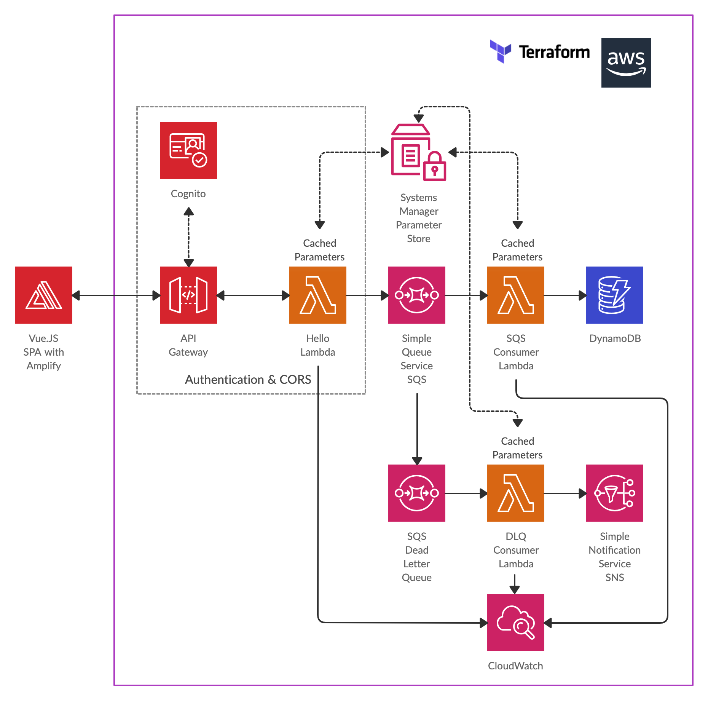

# Hello Microservice - using AWS, Terraform and Vue.js

Example hello microservice using Go AWS Lambdas, API Gateway with CORS and AWS Cognito for authentication - deployed using Terraform.

Also includes a sample Vue.js SPA frontend using AWS amplify auth and amplify api to consume the REST hello service. SPA configured via Terraform output.




Hello Lambda - protected by API gateway, returns CORS header. Invoked with a POST with json { "name": "dozy" }

SQS Consumer - invoked by SQS, updates DynamoDB on SPA login / SPA page refresh after login.

Dead Letter Queue (DLQ) Consumer - to test the dead letter queue, you'll need to manually subscribe to the DLQ topic from the AWS console after deployment. 
To force the SQS consumer to invoke the DLQ, you can change the lambda environment variable ALWAYS_ERROR to TRUE.

Parameters for lambdas stored in SSM parameter store. Parameters cached once retrieved by lambdas for 300 seconds, can be configured via env variables.

SPA using Vue.js and Amplify framework for auth and api - configured from terraform output.

# Setup
```sh
cd terraform && terraform init
```

# AWS region - defaults to eu-west-2
```sh
vi terraform/variables.tf
```

# Build
```sh
make lamdas
```

# Deploy
```sh
make apply
```

# SPA - config, build, run
```sh
make spaconfig
cd spa && npm install
cd spa && npm run serve
```

# Redeploy api gateway
The api gateway sometimes needs redeploying (i.e. when changing auth or CORS settings). In this case you'll need to taint the terraform state with the following and redeploy.

```sh
make taint
make apply
make spaconfig
```


