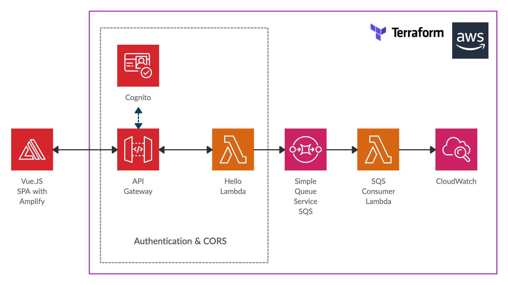

# Hello Microservice - using AWS, Terraform and Vue.js

Example hello microservice using Go AWS Lambdas, API Gateway with CORS and AWS Cognito for authentication - deployed using Terraform. Lambdas communicate via SQS

Also includes a sample Vue.js SPA frontend using AWS amplify auth and amplify api to consume the REST hello service. SPA configured via Terraform output.



# Setup
```sh
cd terraform && terraform init
```

# Build
```sh
make lamdas
```

# Deploy
```sh
make apply
make spaconfig
```

# Build and run SPA locally
```sh
cd spa && npm install
cd spa && npm run serve
```

# Redeploy api gateway
The api gateway sometimes needs redeploying (i.e. when changing auth or CORS settings). In this case you'll need to taint the terraform state with the following and redeploy.

```sh
make taint
make apply
make spaconfig
```

